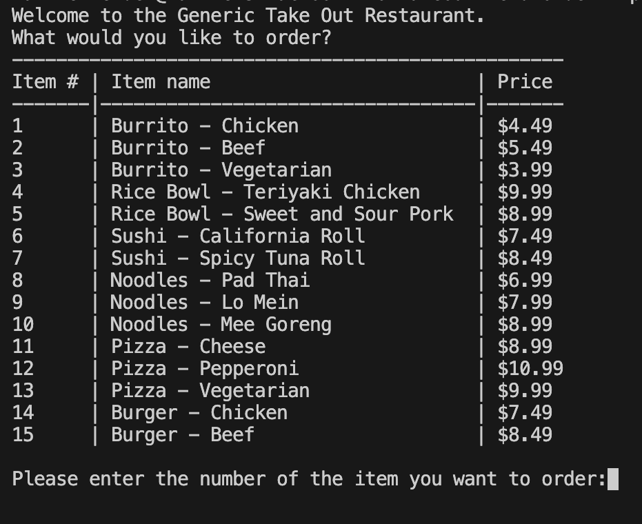
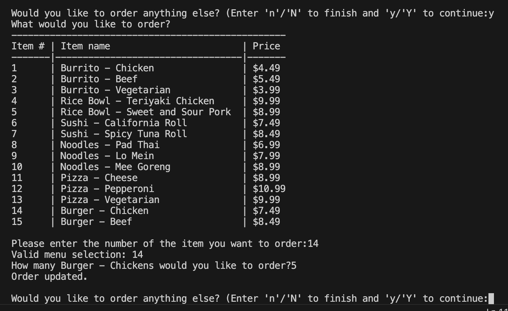
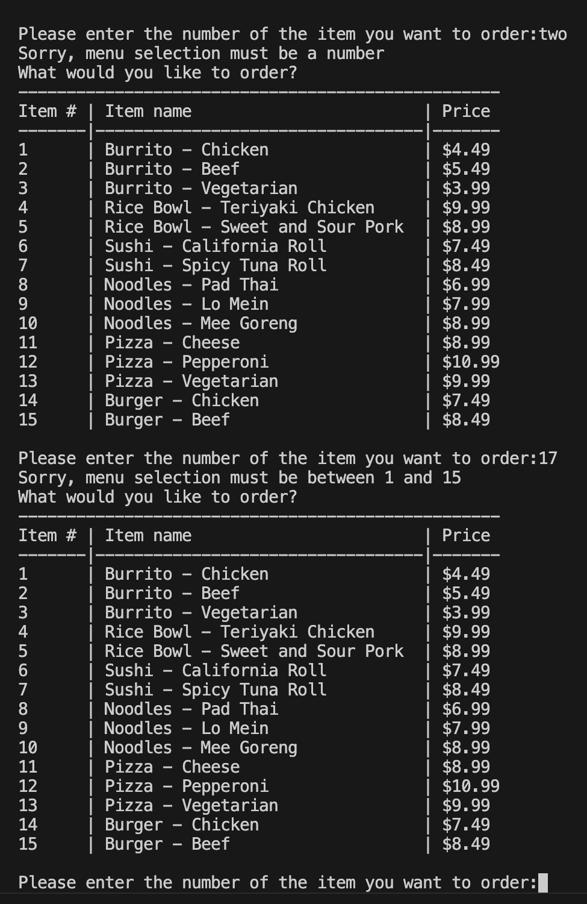
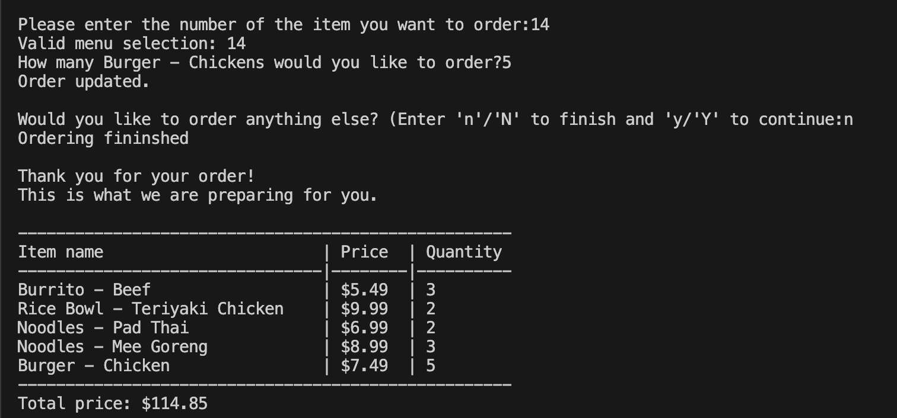

<h1 style="text-align: center">Takeout Menu and Order System</h1>

##  Overview

The Takeout Menu Order System is a Python-based application that allows users to interact with a digital menu, place orders, and receive an itemized receipt. Designed to accommodate customers with hearing or vocal impairments, this system eliminates the need for direct human interaction until order collection.

## Features
Menu Display: View a categorized menu with item names and prices.
Order Placement: Select items, specify quantities, and confirm orders.
Error Handling: Validates user input and provides default selections or error messages for invalid entries.
Itemized Receipt: Displays a detailed receipt with item names, quantities, prices, and the total amount.

## Getting Started
Prerequisites
Python 3.x installed on your system.
## Installation
Clone or download the project repository.
Navigate to the project directory.
## Running the Program
Run the following command in your terminal:
Copy code
```bash
python3 takeout_menu_order_system.py
```
## Usage
When the program runs, user is provided with a Menu with items number, item names and price.
User is prompted to enter a number from the menu selection. The system checks if the user entered a vaild number. It checks against empty input, string input and valid menu item number input (1-15). 
When valid item number is received, it prompts for quantity of the item selected. It allow user to finish ordering or add more in the order. When the user adds another item the order is updated and stored. The user can add as many items he wishes to order. When the ordering is done user can exit and a complete order receipt is displayed with item numbers, item names, price and total price.

## Screenshots

### Taking Order


### Error Handling


### Receipt Interface



## Contribution Guidelines
Contributions to improve the system are welcome. Please follow these steps:

### Fork the repository.
Create a new branch for your feature or bug fix.
Commit your changes and submit a pull request.
## License
Distributed under the MIT License. See LICENSE for more information.
## Contact:
Matthew Mendez   
Email: matthewpmendez@gmail.com<br>
Project Link: https://github.com/Plutarch1971/takeout-menu-order.git


